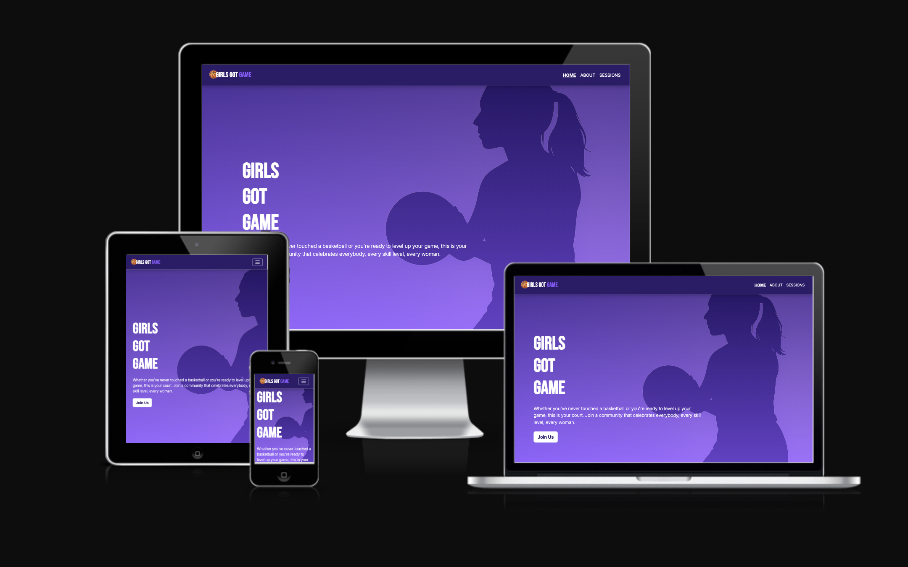
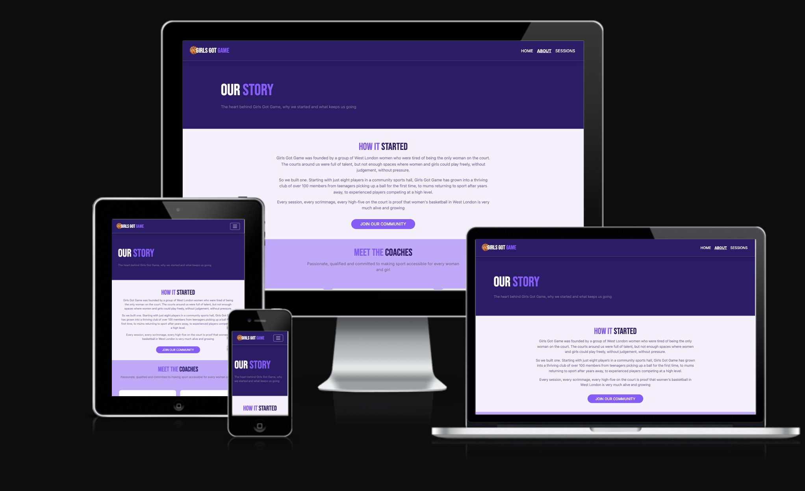
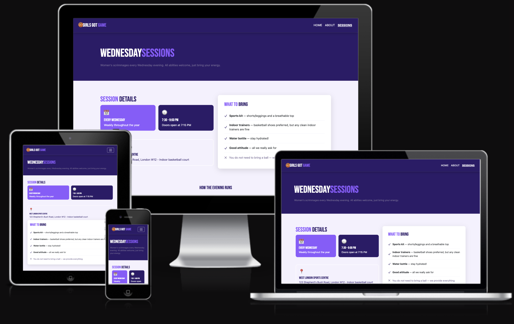
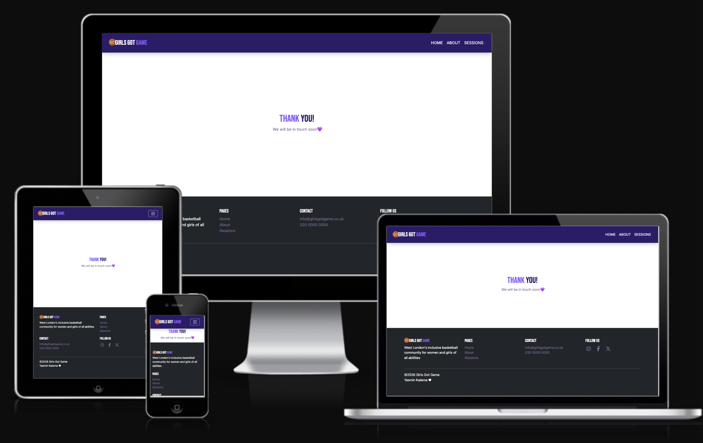

# 🏀 Girls Got Game 

Live Website: https://yazminaaa.github.io/girls-got-game/index.html

Girls Got Game is a community-focused website designed for women and girls who love basketball, from complete beginners picking up a ball for the first time, to advanced players looking to develop their skills and connect with others. 

---

## Table of Contents 

1. [Project Overview](#1-project-overview)
2. [Design](#2-design)
3. [Features](#3-features)
4. [Testing](#4-testing)
5. [Deployment](#5-deployment)
6. [Credits](#6-credits)
7. [AI Declaration](#7-ai-declaration)

---

## 1. Project Overview 

### Purpose 

Girls Got Game is a West London women's basketball club website. The site aims to make baksetball accessible, welcoming and fun for all ability levels, helping users: 

- Find local West London basketball sessions 
- Explore theh club's story and meet coaches 
- Register their interest in joining via a sign-up form 
- stay up to date with the team 

### Target Audience 

- Women and girls of all ages interested in basketball, from complete beginner to advanced players 
- Parents and guardians looking for youth activities for their child 
- Existing club members looking for session times and club information 

---

## 2. Design 

The colour palette was chosen to reflect a bold, energetic design with a feminine edge using warm tones.

| Variable | Hex |

|`--primary`|`#2c1b69`| 
|`--secondary`|`#8c5bff`|
|`--accent`|`#c4a8ff`|
|`--light`|`#f5f1fe`|
|`--dark`|`#0d0a1a`|
|`--muted`|`#7a6e99`|

All colours are stored as CSS variables in `style.css` so the entire palette can be updated fromone place. 

### Wireframes 

--- 

## 3. Features 

### Navigation Bar 

A sticky navigation bar is present across all four pages. it collapes into a hamburger menu on mobile and tablet screens using Bootstrap's responsive navbar. The active page is highlighted with an underline so users always know where they are. 

### Home Page 

The homepage features a full screen hero section with a background image, purple gradient overlay, a headline and a "join Us" button which easily navigates to the sessions page to register your interest. Bellow the hero there is four feature cards explaining why Grils Got Game is the right community for everyone. 

### About Page 

The About page tells the club's origin story and introduces the coaching team.

### Session page 

The Sessions page gives users everything they need to know about attending a session e.g time, location and what to bring. 

### Success / Thank You Page 

A confirmation page shown after the form is submitted, using bootstrap flexbox to centre the message. 

### Footer 

A consistent footer appears on all four pages containing:

- Club description 
- Page navigation links 
- Contact details 
- Social media links 

### Responsive Layout

The site is fully responsive across mobile, tablet, laptop and desktop using Bootstrap grid system and a custom CSS media query (`max-width: 768px`) to adjust font sizes and padding on smaller screens. 

---

## 4. Testing 

### Responsive Testing 

The website was tested for responsiveness using chrome DevTools and the [Am I Responsive](https://bytes.dev/?s=amiresponsive)

**Home Page across devices:**

**About Page across devices:**

**Sesssion Page across devices:**

**Success Page across devices:**

### HTML Validation 

All HTML pages were tested using the [W3C CSS Checker](https://validator.w3.org/#validate_by_input)

No errorrs or warnings were found.

**Home Page HTML Validation check**

## 5. Deployment 

The website was deployed using GitHub Pages 

### Steps to deploy:

1. Push all files to a GitHub repository 
2. In the repository, go to **Settings → Pages** 
3. Under **Source**, select **Deploy from a branch** 
4. Select **main** branch and **/(root)** folder
5. Click **Save** - GitHub will generate a live link 

## 6. Credits 

### Media

- Hero background image - AI generated using Microsoft Designer 
- Social media icons - [Font Awesome](https://fontawesome.com/)
- Fonts - [Google Fonts](https://fonts.google.com/)
- Bootstrap 5 -[getbootstrap.com](https://getbootstrap.com/)
- Responsive device mockup images - [Am I Responsive](https://bytes.dev/?s=amiresponsive)

### Content

-Club infomation, content, session detailsand coach bios are fictional, created for the purpose of this projact

## 7. Ai Declaration 

This project was built with assistance from copilot and Claude for the following purposes:

- To clarify and gain deeper understanding of code 
- Content generation 
- Suggesting CSS fixes for responsive layout issue (media query)

---

*©2026 Grirls Got Game - Yasmin Kalema ♡*
[Back to the top](#-girls-got-game)

